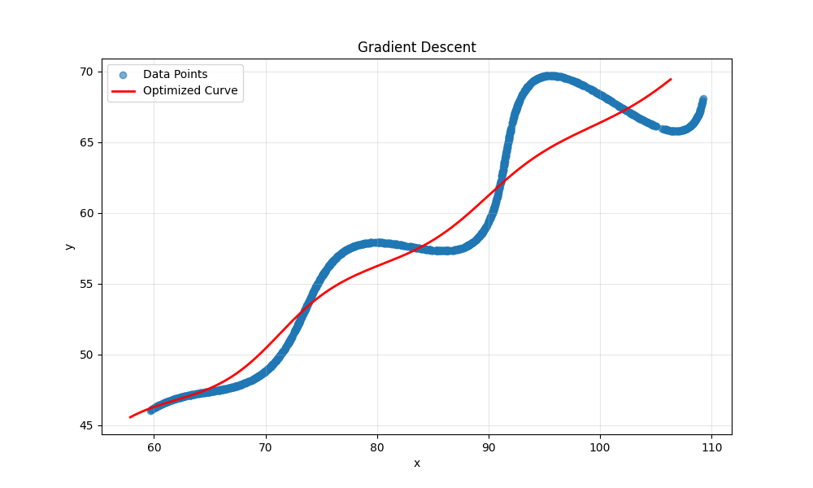
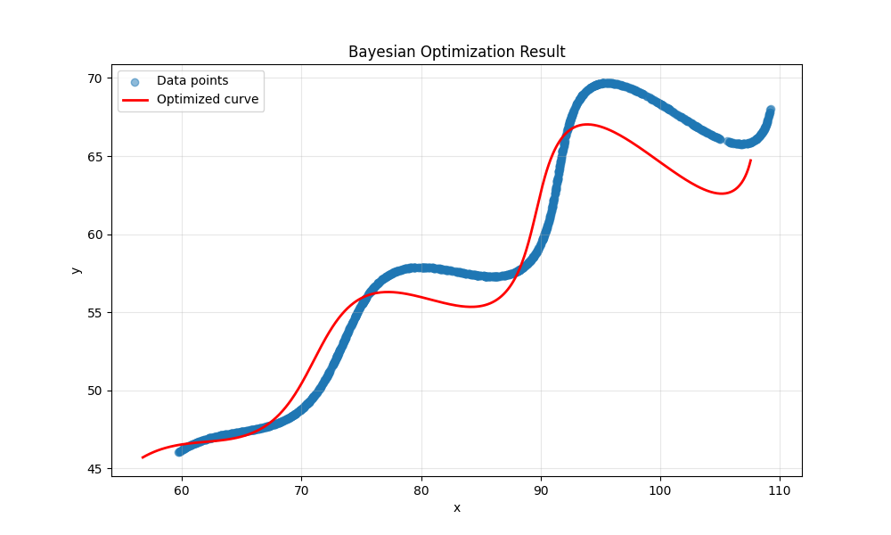
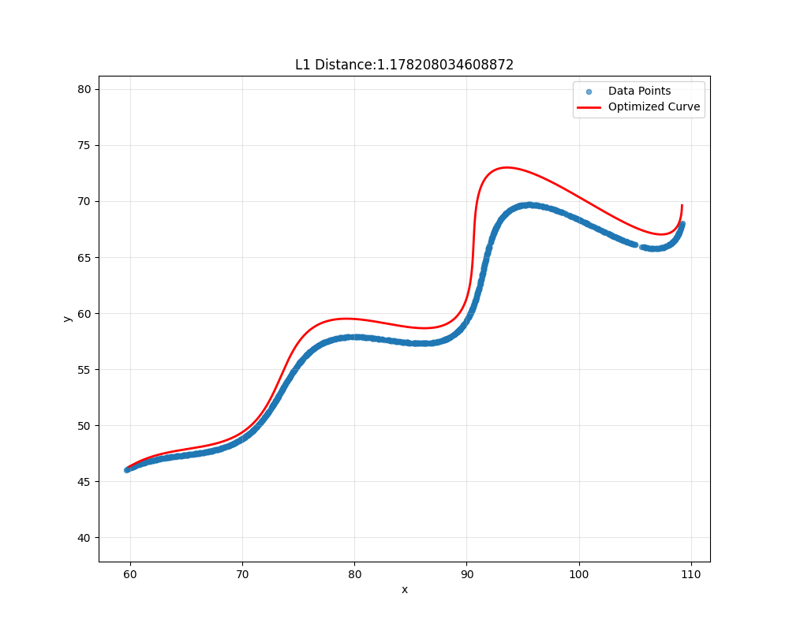

# Problem

Find the values of unknown variables in the given parametric equation of a curve :

$$
\begin{array}{c}
x= \left(t*\cos(\theta)-e^{M\left|t\right|}\cdot\sin(0.3t)\sin(\theta)\ +X \right ) \\
y = \left (42 + t*\sin(\theta)+e^{M\left|t\right|}\cdot\sin(0.3t)\cos(\theta)\right)
\end{array}
$$

unknowns are 

$$
\begin{array}{c}
\theta , M ,X 
\end{array}
$$

Given range for unknown params is :

$$
\begin{array}{c}
0^{\circ} < \theta < 50^{\circ} \\
-0.05 < M < 0.05 \\
0 < X < 100
\end{array}
$$

parameter ‘t’ has range:

$$
\begin{array}{c}
6 < t < 60
\end{array}
$$

# Solution

Code for the algorithms used is given [here](flam.ipynb)

We are given a parametric curve, along with some of the points that lie on the curve, and asked to approximate the exact values of the parameters used. 

This was a bit different than some of the ML problems that I have solved, as it was an optimization problem, So I decided to look up and understand some of the techniques used to solve optimization problems.

I tried using some of the algorithms given [here](https://www.geeksforgeeks.org/machine-learning/optimization-algorithms-in-machine-learning/) to see which technique best fits the problem

## Gradient Descent (First Order Algorithms)
> Gradient Descent is an iterative optimization algorithm used to minimize a cost function by adjusting model parameters in the direction of the steepest descent of the function’s gradient. In simple terms, it finds the optimal values of weights and biases by gradually reducing the error between predicted and actual outputs. [Source](https://www.geeksforgeeks.org/data-science/what-is-gradient-descent/)

Since the loss was pretty high, I tried the next algorithm

## Bayesian Parameter Optimization
>Bayesian Optimization is an automated optimization technique designed to find optimal hyperparameters by treating the search process as an optimization problem. It aims to maximize an objective function f(x), particularly beneficial for functions that are computationally expensive to evaluate and are treated as "black boxes," where their internal structure is unknown. [Source](https://www.geeksforgeeks.org/machine-learning/hyperparameter-optimization-based-on-bayesian-optimization/) [Code](https://github.com/bayesian-optimization/BayesianOptimization)

It converges much better than Gradient Descent, but there is room for fine tuning

## Grid Search (Random Search)
>With randomized search, instead of specifying a list of values for each hyperparameter, you specify a distribution for each hyperparameter. The randomized search algorithm will then sample values for each hyperparameter from its corresponding distribution and train a model using the sampled values. [Source](https://www.geeksforgeeks.org/machine-learning/comparing-randomized-search-and-grid-search-for-hyperparameter-estimation-in-scikit-learn/)

While it gave better results than Bayesian Parameter Optimization, its computationally too expensive to run given the range of the parameters.

## Particle Swarm Optimization
>Particle Swarm Optimization (PSO) is a population-based optimization algorithm inspired by the social behavior of bird flocks and fish schools. Each individual in the swarm (a particle), represents a potential solution. These particles move through the search space by updating their positions based on experience and knowledge shared by neighboring particles. This cooperative mechanism helps the swarm converge toward optimal or near-optimal solutions. [Source](https://www.geeksforgeeks.org/machine-learning/optimization-algorithms-in-machine-learning/) [Code](https://pythonhosted.org/pyswarm/)

It by far gave the best parameter estimation (2.99995036e+01, 3.00002457e-02, 5.49993364e+01) and loss (0.01) and nearly fitted the curve perfectly. Visually by the plot, we can see that it covers all the points given in the data.

## Final Parameters
Rounding the parameters given by Particle Swarm Optimization, we get the parameters used in the problem with ~ 0 loss. 

$$
\begin{array}{c}
\theta = 30 \\
M = 0.03 \\
X = 55
\end{array}
$$

[Plot in desmos](https://www.desmos.com/calculator/mgi3cg09nj)

